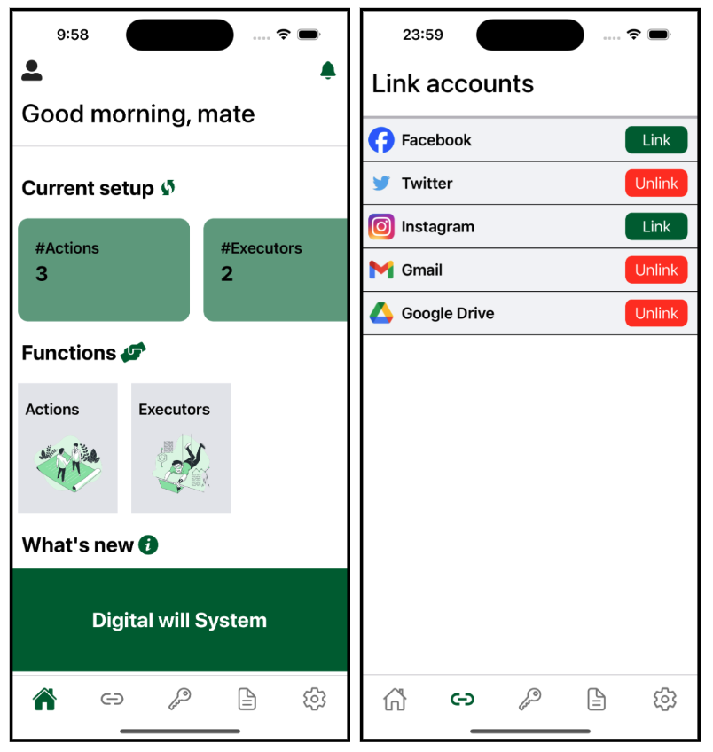

# Digital Will App 📱

This repository contains the source code for the **Digital Will App**, a React Native Expo project that provides a secure and user-friendly platform for creating and managing digital legacy.
The code in this repo is a static version to protect account privacy and backend server information. However, the data files included are real and were saved from actual server interactions. In a real-world scenario, this app would interact with a backend server. You can run it locally or access it using the pre-packaged Expo link. Please refer to the following sections for more details.



**Link for the demo video** 🎥: [Link](https://youtu.be/yqgjz6WW4gU)

## Access via pre-packaged Expo Link (recommended)
You can run the app on your local devices by scanning the QR code below, but you need to install the app "Expo Go" on your device first, which is free to download on the App Store and the Google Play Store.
- Expo GO: [Link](https://expo.dev/go)


## Local Installation
```bash
# Assume you clone this repo and cd into the directory

# Install the packages
npm install

npm start

# For an IOS device, assume there is an iOS simulator running.
i

# For Android devices, assume there is an Android simulator running.
a
```
Note: 
- If you want to run it on an iOS simulator, you need to install `XCode` first, please refer to this [link](https://docs.expo.dev/workflow/ios-simulator/) for more info.
- If you want to run it on an Android simulator, you need to install `Android Studio` first, please refer to this [link](https://docs.expo.dev/workflow/android-studio-emulator/) for more info.


